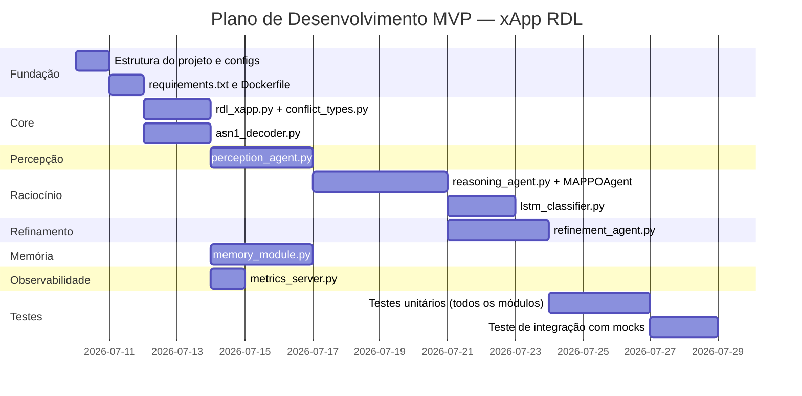

# xApp RDL — Deployment

## Visão Geral

Desenvolvimento da **xApp RDL (Resource and Decision Layer)**, um orquestrador cognitivo para redes O-RAN que monitora múltiplas xApps, detecta conflitos diretos e indiretos, e os resolve via aprendizado por reforço multiagente (MARL). O projeto é baseada no Python xApp Framework do OSC.

---

## Decisões de Design (Confirmadas)

| # | Questão | Decisão |
|---|---------|--------|
| Q1 | Near-RT RIC | **OSC Near-RT RIC (O-RAN Software Community)** |
| Q2 | E2 Node (gNB) | **srsRAN Project** |
| Q3 | Linguagem da xApp | **Python** (orquestração principal) |
| Q4 | Integração RIC | **`ricxappframe` via RMR e REST** |
| Q5 | Algoritmo MARL | **MAPPO via Ray RLlib** |
| Q6 | Machine Learning | **Scikit-learn** (para validação semântica e classificações baseline) |
| Q7 | Knowledge Graph | **Híbrido: Memgraph (backend persistente) + NetworkX (in-memory frontend)** |

> [!NOTE]
> **Referência de implementação**: O projeto usará Python puro. O ambiente de testes usa **OSC Near-RT RIC** e **srsRAN** como RAN Node (gNB), alinhado com as especificações do framework OSC (`openran-br-blueprint`).

---

## Proposta de Escopo para MVP

Com base nos riscos identificados e na complexidade, proponho iniciar com o **MVP funcional** que valida a arquitetura core:

### MVP — Entregáveis
1. Estrutura completa do projeto (`iqos-xapp-rdl/`)
2. xApp base com `ricxappframe` (compatível com OSC RIC)
3. Módulo de Percepção com detecção de conflitos diretos e indiretos
4. Módulo de Raciocínio com resolução por prioridade estática + MAPPO básico
5. Módulo de Refinamento (validação semântica via **Scikit-learn** e similaridade)
6. Módulo de Memória (buffer de sessão + NetworkX para KG)
7. Decodificador ASN.1 E2SM-KPM com **PyCrate**
8. Expor métricas via Prometheus
9. Dockerfile, config RMR e xapp_descriptor.json
10. Testes unitários focados na lógica do RDL com mocks de RMR

---

## Arquitetura Proposta (Detalhada)

```
iqos-xapp-rdl/
├── configs/
│   ├── xapp_descriptor.json       # Metadados do deploy (nome, versão, endpoints)
│   └── schema.json                # JSON Schema para validação de config
├── src/
│   ├── __init__.py
│   ├── rdl_xapp.py                # Classe principal em Python (RICxApp via ricxappframe)
│   ├── perception_agent.py        # Coleta KPMs, detecta conflitos direto/indireto
│   ├── reasoning_agent.py         # Resolução: prioridade estática + MAPPO
│   ├── refinement_agent.py        # Validação 3 níveis via Scikit-learn
│   ├── memory_module.py           # Buffer de sessão + KG (NetworkX)
│   ├── asn1_decoder.py            # Decodificação E2SM-KPM via PyCrate
│   ├── conflict_types.py          # Enums e dataclasses para tipos de conflito
│   ├── metrics_server.py          # Prometheus metrics exporter
│   └── utils.py                   # Helpers, logging estruturado
├── models/
│   ├── mappo_agent.py             # Implementação do agente MAPPO
│   ├── intent_classifier.py       # Classificador de intenção via Scikit-learn
│   └── weights/                   # Pesos pré-treinados
├── docker/
│   ├── Dockerfile
│   └── docker-compose.yml         # Para testes locais com mocks
├── requirements.txt
├── requirements-dev.txt
└── README.md
```

---

## Mudanças Propostas por Componente

---

### Fundação do Projeto

#### [NEW] `configs/xapp_descriptor.json`
Metadados para registro no OSC RIC App Manager (AppMgr). Define nome, versão, endpoints REST e configurações de RMR.

#### [NEW] `configs/schema.json`
JSON Schema para validação de configurações da xApp em runtime.

#### [NEW] `requirements.txt`
```
ricxappframe>=2.0.0    # Framework Python do OSC Near-RT RIC
pycrate>=0.6.0         # Decodificação ASN.1
torch>=2.0.0
ray[rllib]>=2.4.0
scikit-learn>=1.3.0    # Machine Learning baseline e Refinamento
networkx>=3.0          # Knowledge Graph (frontend)
neo4j>=5.0.0           # Driver Memgraph
prometheus-client>=0.16.0
numpy>=1.24.0
pydantic>=2.0.0        # Validação de dados
structlog>=23.0.0      # Logging estruturado
```

---

### Módulo Core

#### [NEW] `src/rdl_xapp.py`
Classe principal `RDLxApp` que herda de `RICxApp` (ricxappframe). Responsabilidades:
- Inicializar e orquestrar os 4 módulos
- Registrar callbacks RMR (RIC_INDICATION, AI_POLICY_REQ)
- Subscrever a relatórios KPM via interface OSC (REST/RMR)
- Gerenciar o ciclo de vida e processamento de conflitos

#### [NEW] `src/conflict_types.py`
Tipos de dados compartilhados:
- `ConflictType` (Enum): `DIRECT`, `INDIRECT`
- `ConflictSeverity` (Enum): `LOW`, `MEDIUM`, `HIGH`, `CRITICAL`
- `ConflictEvent` (dataclass): xapp_id, parameter, action, timestamp
- `ResolutionAction` (dataclass): target_xapp, new_value, confidence, validation_level

---

### Módulo de Percepção

#### [NEW] `src/perception_agent.py`
`PerceptionAgent` — detecta conflitos monitorando ações de xApps:
- **Coleta de KPMs**: subscrição E2SM-KPM via `ricxappframe` subscription API
- **Detecção Direta**: tabela hash de parâmetros controlados por xApp; colisão = conflito direto
- **Detecção Indireta**: grafo de dependências de KPIs (ex: PRB_alloc → throughput ← scheduler); dois agentes afetando a mesma KPI = conflito indireto
- Publica `ConflictEvent` para o `ReasoningAgent`

#### [NEW] `src/asn1_decoder.py`
`E2SMKPMDecoder` — decodifica mensagens ASN.1 E2SM-KPM:
- Usa `pycrate` para parsear `RIC-Indication` PDUs (necessário pois o OSC RIC encaminha APER payload puro)
- Extrai métricas: `DRB.UEThpDl`, `RRU.PrbUsedDl`, etc.
- Retorna dicionário Python estruturado para o módulo de Percepção

---

### Módulo de Raciocínio

#### [NEW] `src/reasoning_agent.py`
`ReasoningAgent` — decide como resolver cada conflito:
- **Prioridade Estática** (fast path, < 10ms): tabela de prioridades baseada em A1 policies do operador
- **MAPPO** (slow path, < 100ms): chama `MAPPOAgent` para conflitos não cobertos pela prioridade estática
- **Distilação**: periodicamente consolida políticas aprendidas em regras estáticas (reduz carga do MARL)
- Emite `ResolutionAction` para o `RefinementAgent`

#### [NEW] `models/mappo_agent.py`
`MAPPOAgent` — implementação do Multi-Agent PPO:
- Espaço de observação: vetor de KPMs atuais + histórico de ações (últimos N passos)
- Espaço de ação: delta de reconfiguração de parâmetros (ex: ajuste de PRB quota)
- Função de recompensa: combinação ponderada de throughput, latência e consumo energético
- Backend: PyTorch, treinamento offline + fine-tuning online

#### [NEW] `models/intent_classifier.py`
`IntentClassifier` — usando **Scikit-learn** para classificar a intenção:
- Entrada: features extraídas da rede ou json
- Algoritmo: Random Forest ou SVM provido pelo Scikit-learn
- Saída: vetor de pesos para cada objetivo (QoS, energy, coverage)

---

### Módulo de Refinamento

#### [NEW] `src/refinement_agent.py`
`RefinementAgent` — validação hierárquica em 3 níveis usando **Scikit-learn**:

| Nível | Tipo | Latência Alvo | Implementação |
|-------|------|---------------|---------------|
| 1 | Sintaxe e sanidade | < 10ms | Regras Pydantic + ranges válidos |
| 2 | Similaridade histórica | < 100ms | **Scikit-learn** (`sklearn.metrics.pairwise.cosine_similarity`) |
| 3 | Verificação formal | < 500ms (assíncrono) | Checagem de constraints semânticas |

- Ações aprovadas no Nível 1 ou 2 são enviadas imediatamente
- Ações críticas aguardam Nível 3 (ou são bloqueadas e notificadas)

---

### Módulo de Memória

#### [NEW] `src/memory_module.py`
`MemoryModule` — três sub-módulos:
- **SessionBuffer**: deque com capacidade limitada (N últimas ações/decisões), persistido em SDL (Redis)
- **KnowledgeGraph**: grafo NetworkX direcionado com entidades (xApp, KPI, parâmetro, célula) e relações (controls, affects, conflicts_with)
- **RAGRetriever**: busca semântica em documentos (RFCs, manuais) via Sentence-Transformers; documentos pré-indexados em FAISS

---

### Observabilidade

#### [NEW] `src/metrics_server.py`
Expõe métricas Prometheus em `/metrics` (porta 8080):
- `rdl_conflicts_detected_total` (counter, labels: type, severity)
- `rdl_conflicts_resolved_total` (counter, labels: resolution_type)
- `rdl_decision_latency_seconds` (histogram)
- `rdl_active_xapps` (gauge)
- `rdl_kpm_messages_total` (counter)

---

### Infraestrutura

#### [NEW] `docker/Dockerfile`
Multi-stage build:
- Stage 1: instala dependências Python
- Stage 2: imagem runtime mínima com a xApp

#### [NEW] `docker/docker-compose.yml`
Para testes locais: containers da xApp RDL + mock de E2 (usando e2sim ou stub) + Prometheus + Grafana.

---

### Testes

#### [NEW] `tests/conftest.py`
Fixtures globais:
- `mock_rmr_xapp`: stub do `ricxappframe` sem dependência de RIC real
- `mock_e2_indication`: mensagem RIC_INDICATION sintética com KPMs fixos
- `mock_a1_policy`: payload de A1 policy de exemplo

#### [NEW] `tests/test_perception.py`
- Detecta conflito direto entre duas xApps no mesmo parâmetro
- Detecta conflito indireto via grafo de dependências de KPI
- Não gera falso positivo para xApps em parâmetros distintos

#### [NEW] `tests/test_reasoning.py`
- Resolução por prioridade estática correta
- MARL produz ação dentro do espaço válido
- Fallback para prioridade estática quando MARL excede timeout

#### [NEW] `tests/test_refinement.py`
- Rejeita ação com sintaxe inválida (Nível 1)
- Aprova ação similar a histórico (Nível 2)
- Bloqueia ação crítica até verificação formal (Nível 3)

---

## Plano de Execução (por fases)



---

## Plano de Verificação

### Testes Automatizados
```bash
pytest tests/ -v --cov=src --cov-report=term-missing
# Alvo: > 80% de cobertura
```

### Validação de Build
```bash
docker build -f docker/Dockerfile -t rdl-xapp:latest .
docker-compose -f docker/docker-compose.yml up --abort-on-container-exit
```

### Validação de Métricas
- Confirmar endpoints `/metrics` e `/health` respondem
- Confirmar que `rdl_conflicts_detected_total` incrementa com conflito simulado

### Latência
- Benchmark do ciclo completo Percepção → Raciocínio → Refinamento com dados mock
- Alvo: p95 < 100ms para o fast path (Nível 1 + prioridade estática)


## Diagrama de Arquitetura

Aqui está a representação visual da arquitetura proposta para a **xApp RDL** interagindo com o ecossistema O-RAN (srsRAN e OSC Near-RT RIC).

```mermaid
flowchart TD
    %% Cores e Estilos
    classDef ran fill:#e3f2fd,stroke:#1565c0,stroke-width:2px;
    classDef ric fill:#fff3e0,stroke:#e65100,stroke-width:2px;
    classDef xapp fill:#f3e5f5,stroke:#4a148c,stroke-width:2px;
    classDef module fill:#ffffff,stroke:#6a1b9a,stroke-width:1px;
    classDef db fill:#e8f5e9,stroke:#2e7d32,stroke-width:2px;

    subgraph RAN["E2 Node (srsRAN gNB)"]
        CU[CU/DU / Scheduler]
    end

    subgraph RIC["OSC Near-RT RIC"]
        E2T[E2 Termination]
        RTMgr[Routing Manager]
        RMR_BUS[[RMR Bus]]
        E2T <--> |E2AP| CU
        E2T <--> RMR_BUS
        RTMgr -.-> RMR_BUS
    end

    subgraph XAPP["xApp RDL (Orquestrador Cognitivo em Python)"]
        direction TB
        RIC_INT[Interface ricxappframe]
        ASN1[Decodificador ASN.1 / PyCrate]
        
        subgraph CORE["Lógica Core da RDL"]
            PERC[Módulo de Percepção<br>Detecção de Conflitos<br>Grafo de Dependências]
            REAS[Módulo de Raciocínio<br>Prioridade Estática + MAPPO]
            REF[Módulo de Refinamento<br>Validação via Scikit-learn]
        end
        
        subgraph MEM["Gestão de Conhecimento"]
            MEM_MOD[Módulo de Memória]
            KG[(Knowledge Graph<br>Memgraph + NetworkX)]
            MEM_MOD <--> KG
        end
        
        METRICS((Prometheus<br>Metrics))
    end

    %% Fluxo de Dados e Controle
    RMR_BUS --> |RIC_INDICATION<br>(E2SM-KPM APER)| RIC_INT
    RIC_INT --> |Payload Puro| ASN1
    ASN1 --> |Métricas KPM em Dict| PERC
    
    %% Detecção de outras xApps (Simuladas ou reais)
    OTHER_XAPPS[Outras xApps<br>QoS, Energy, Handover] -.-> |Ações de Controle| PERC
    
    PERC --> |Eventos de Conflito<br>(Direto/Indireto)| REAS
    REAS --> |Ação de Resolução Proposta| REF
    REF --> |Ação de Controle Validada| RIC_INT
    
    RIC_INT --> |RIC_CONTROL_REQ<br>(E2SM-RC)| RMR_BUS
    
    %% Conexões Auxiliares
    PERC -.-> |Registra Ações/Estados| MEM_MOD
    REAS -.-> |Consulta Histórico| MEM_MOD
    REF -.-> |Consulta Similaridade| MEM_MOD
    
    CORE -.-> METRICS

    %% Atribuição de Classes
    class RAN ran;
    class RIC ric;
    class XAPP xapp;
    class PERC,REAS,REF,RIC_INT,ASN1,MEM_MOD module;
    class KG db;
```

### Explicação do Fluxo (Ciclo Fechado)

1. **Coleta**: O **srsRAN (gNB)** envia métricas (KPMs) codificadas em ASN.1 para o **OSC Near-RT RIC**, que roteia a mensagem via **RMR** para a nossa xApp RDL.
2. **Decodificação e Percepção**: O `ricxappframe` recebe a mensagem e a repassa ao `PyCrate` para decodificar. O **Módulo de Percepção** usa esses dados e as ações interceptadas de outras xApps para detectar se existe algum conflito.
3. **Resolução**: Se houver conflito, o **Módulo de Raciocínio** entra em cena. Se for um caso simples, ele resolve rapidamente via tabelas de prioridade; se for um conflito indireto complexo, a decisão é delegada ao agente de aprendizado por reforço (MAPPO).
4. **Validação**: A decisão passa pelo **Módulo de Refinamento**, que utiliza *Scikit-learn* para checar o nível de similaridade da decisão com o histórico positivo do Grafo de Conhecimento (Memgraph) e para validar as regras semânticas.
5. **Ação**: O comando validado é enviado de volta ao RIC (via E2SM-RC) para atuar de forma segura sobre a rede RAN. Toda a operação gera métricas consumíveis pelo Prometheus.
