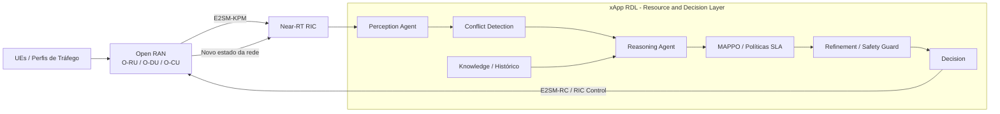
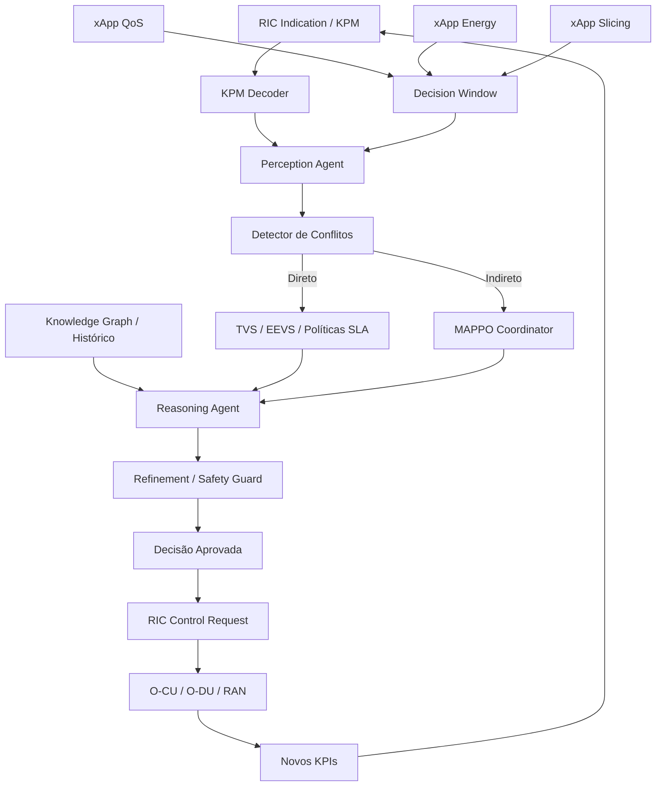
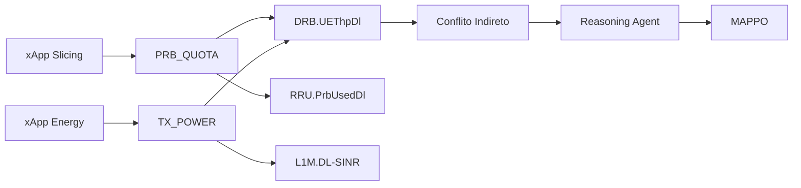
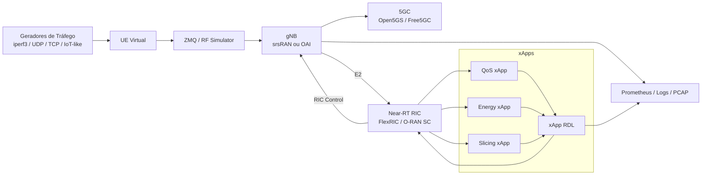
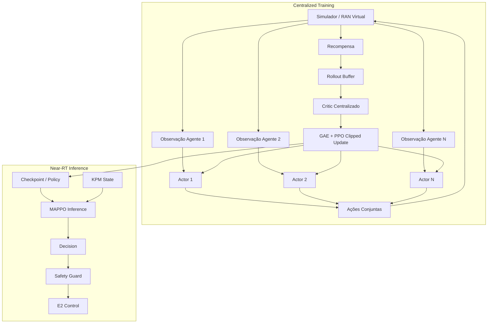
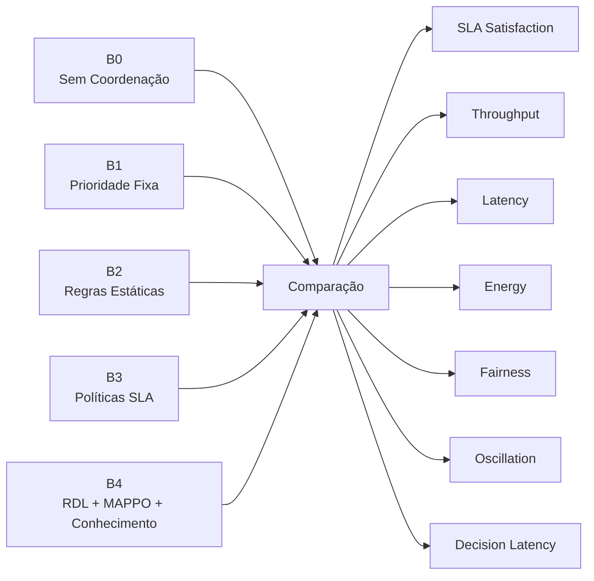
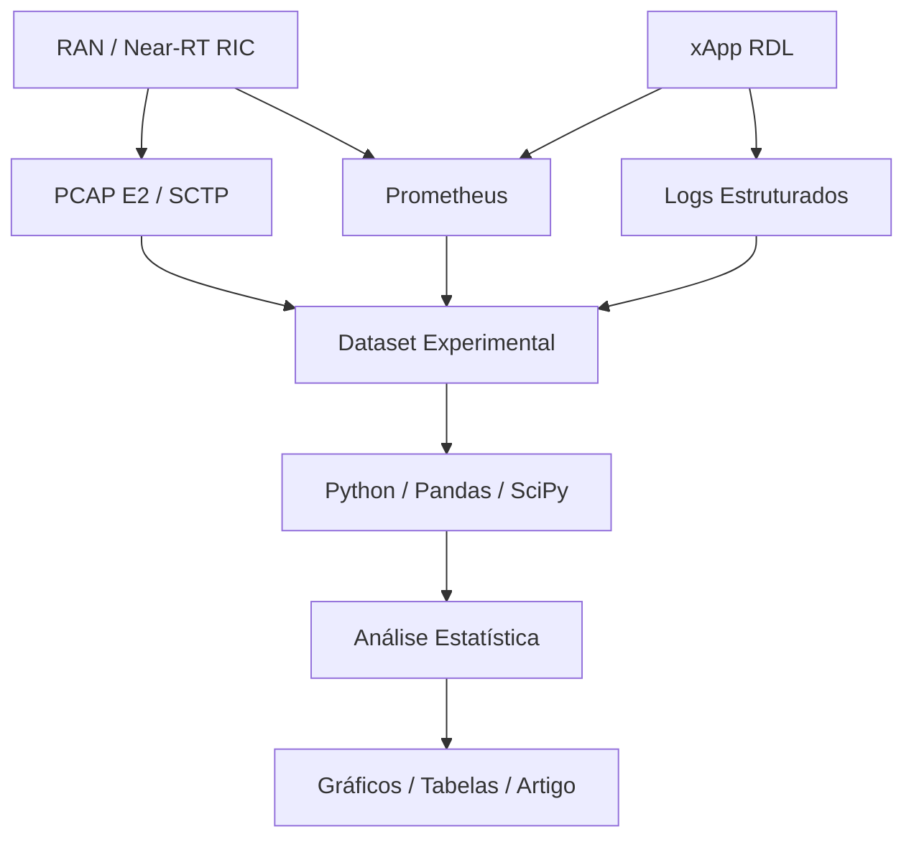
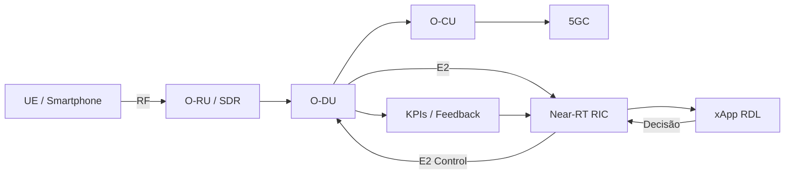

# Simulação, Teste e Validação de um xApp Cognitivo para Pesquisas em 6G

## Introdução

A simulação e a validação experimental de um xApp voltado a pesquisas em 6G não devem ser entendidas como a simples execução de um algoritmo sobre uma infraestrutura de rádio rotulada como “6G”. Na prática, em 2026, a abordagem cientificamente mais sólida consiste em utilizar uma infraestrutura programável baseada em 5G Advanced e Open RAN como plataforma experimental para investigar mecanismos considerados centrais para redes Beyond-5G/6G, tais como inteligência nativa de rede, automação de controle, aprendizado por reforço multiagente, coordenação entre aplicações, gerenciamento orientado a contexto, detecção de conflitos, otimização multiobjetivo, uso de conhecimento estruturado e operação em ciclo fechado.

Nesse contexto, o xApp RDL — Resource and Decision Layer — pode ser tratado como uma camada cognitiva de coordenação executada no Near-RT RIC. Sua função não deve ser restrita a escolher uma ação de controle, mas atuar como um árbitro inteligente entre múltiplas xApps que, de forma independente, tentam modificar parâmetros da RAN. A principal hipótese experimental consiste em verificar se a introdução dessa camada cognitiva permite detectar conflitos diretos e indiretos, selecionar ações mais adequadas ao estado corrente da rede, preservar requisitos de SLA, reduzir oscilações de controle e manter a latência de decisão dentro de uma faixa compatível com operações Near-RT.

A arquitetura conceitual do experimento pode ser representada pela Figura 1. O tráfego dos usuários produz alterações no estado da RAN, os elementos O-CU/O-DU geram métricas, essas métricas são transportadas por E2SM-KPM ao Near-RT RIC e processadas pelo RDL. Após percepção, análise de conflitos, raciocínio e validação de segurança, uma ação pode ser encaminhada à rede por E2SM-RC, fechando o ciclo de controle.



**Figura 1 — Arquitetura geral do ciclo cognitivo RDL em uma infraestrutura experimental Open RAN.**

O aspecto mais importante dessa arquitetura é que o RDL não atua como uma xApp convencional isolada. Ele recebe ou observa propostas provenientes de diferentes aplicações de controle e procura identificar quando duas ou mais decisões podem produzir efeitos incompatíveis. Esse comportamento é particularmente relevante em redes futuras, nas quais diferentes objetivos — throughput, energia, latência, slicing, mobilidade e fairness — podem ser perseguidos simultaneamente por controladores independentes.

A arquitetura interna pode ser compreendida como uma sequência de percepção, construção de contexto, raciocínio, decisão e refinamento. O Perception Agent recebe métricas de rede e propostas de ação. O mecanismo de conflito compara as ações e seus impactos sobre KPIs. O Reasoning Agent escolhe uma estratégia de resolução, podendo utilizar histórico, políticas baseadas em SLA ou o coordenador MAPPO. Por fim, o Refinement Agent impede que ações inseguras, fora de limites ou temporalmente inadequadas sejam aplicadas diretamente à RAN.



**Figura 2 — Arquitetura interna e fluxo de decisão do xApp RDL.**

A etapa inicial de validação deve ocorrer sem uma RAN real. O objetivo é comprovar que os componentes lógicos do RDL funcionam de maneira isolada e determinística. Nessa fase, pode-se criar um gerador de KPMs sintéticos capaz de produzir estados artificiais contendo valores como SINR, CQI, BLER, utilização de PRBs, throughput, latência, energia e número de UEs. Em paralelo, ações propostas por diferentes xApps podem ser injetadas diretamente no RDL. Isso permite testar rapidamente milhares de combinações e observar se os conflitos são corretamente classificados.

Um conflito direto ocorre quando duas xApps tentam modificar o mesmo parâmetro do mesmo nó. Por exemplo, uma xApp orientada a QoS pode solicitar `PRB_QUOTA = 80%`, enquanto uma xApp de economia de energia pode solicitar `PRB_QUOTA = 40%`. Nesse caso, a incompatibilidade é explícita. O detector deve reconhecer que existe disputa pelo mesmo recurso e encaminhar o evento ao mecanismo de resolução.

```text
xApp QoS                       xApp Energy
   |                               |
   | PRB_QUOTA = 80%               | PRB_QUOTA = 40%
   |                               |
   +---------------+---------------+
                   |
                   v
              Mesmo nó
              Mesmo parâmetro
              Valores distintos
                   |
                   v
           CONFLITO DIRETO
                   |
                   v
             Reasoning Agent
                   |
                   v
          Política / Decisão
```

O conflito indireto é mais importante do ponto de vista científico. Nesse caso, duas xApps controlam parâmetros diferentes, porém os parâmetros influenciam um mesmo KPI. Por exemplo, uma xApp de slicing pode alterar `PRB_QUOTA`, enquanto outra xApp de energia altera `TX_POWER`. Embora os parâmetros não sejam iguais, ambos podem afetar throughput. O RDL precisa compreender que os efeitos das ações se encontram em um mesmo ponto do sistema e, por isso, podem ser antagonistas.



**Figura 3 — Exemplo de conflito indireto detectado pela interseção de efeitos sobre um KPI comum.**

Uma característica central do RDL é o uso de uma janela temporal de decisão. Em vez de processar cada proposta imediatamente, o sistema pode acumular ações por um pequeno intervalo, por exemplo 200 ms, e processá-las como um lote. Essa estratégia permite detectar conflitos que não seriam observados caso cada ação fosse analisada isoladamente. Em termos experimentais, a janela constitui uma variável importante, pois existe um compromisso entre contexto e latência. Janelas muito pequenas reduzem o tempo de espera, mas podem perder correlações temporais; janelas maiores oferecem uma visão mais abrangente das ações concorrentes, porém aumentam o tempo de decisão. Uma bateria de experimentos com 25, 50, 100, 200 e 500 ms permite quantificar esse compromisso.

```text
Tempo -------------------------------------------------------------->

t=0 ms         t=55 ms          t=121 ms               t=200 ms
  |               |                |                       |
  v               v                v                       v
xApp QoS      xApp Energy      xApp Slicing           FECHA JANELA
 Ação A         Ação B            Ação C                   |
    \              |                /                      |
     \             |               /                       v
      +------------+--------------+                 [A, B, C]
                                                         |
                                                         v
                                              Detecção de conflitos
                                                         |
                                                         v
                                                     Decisão
```

Depois que a lógica interna estiver comprovada, o sistema deve ser conectado a uma RAN virtualizada. Uma configuração apropriada pode utilizar srsRAN ou OpenAirInterface, um Core 5G como Open5GS ou Free5GC e uma interface de rádio simulada por ZMQ ou RF simulator. Nesse ponto, o objetivo deixa de ser apenas verificar se o algoritmo toma uma decisão e passa a ser demonstrar que o estado observado deriva de uma rede efetivamente em execução.

A arquitetura experimental pode ser organizada com um UE virtual, gNB, Core 5G, Near-RT RIC e xApps. Tráfego TCP, UDP, vídeo ou padrões representativos de aplicações de baixa latência pode ser gerado para produzir mudanças controladas na RAN. O Near-RT RIC recebe telemetria por E2 e o RDL passa a observar métricas reais da pilha.



**Figura 4 — Testbed virtualizado para validação do xApp RDL.**

A integração com E2 deve ser validada em etapas. Primeiramente, deve-se comprovar o estabelecimento da associação entre gNB e Near-RT RIC por meio de mensagens E2 Setup. Depois, uma assinatura KPM deve ser configurada e os `RIC_INDICATION` devem ser capturados. Somente após essa etapa o RDL deve utilizar os dados como entrada para o Perception Agent. O passo seguinte é permitir que uma decisão aprovada seja transformada em uma ação de controle e enviada à RAN. A sequência completa de evidências precisa estar registrada em PCAPs, logs e métricas de observabilidade.

```text
gNB
 |
 | E2 Setup Request
 v
Near-RT RIC
 |
 | E2 Setup Response
 v
gNB
 |
 | Subscription Request
 v
Near-RT RIC
 |
 | Subscription Response
 v
gNB
 |
 | RIC Indication / KPM
 v
RDL
 |
 | Perception -> Reasoning -> Safety
 v
Near-RT RIC
 |
 | RIC Control Request
 v
gNB
 |
 | ACK / Failure
 v
RDL
```

Quando o pipeline de comunicação estiver estável, o aprendizado por reforço pode ser integrado de forma mais rigorosa. A arquitetura MAPPO deve seguir o princípio de Centralized Training and Decentralized Execution. Durante o treinamento, múltiplos agentes produzem ações, o ambiente retorna recompensas e um crítico centralizado pode utilizar o estado global para avaliar as políticas. Durante a operação do Near-RT RIC, o ideal é utilizar políticas previamente treinadas e executar apenas inferência.



**Figura 5 — Pipeline recomendado para treinamento e inferência MAPPO.**

O vetor de estado do agente deve refletir diferentes dimensões da rede. Em vez de observar apenas throughput ou utilização de PRBs, recomenda-se organizar o estado em grupos de variáveis. O estado de rádio pode incluir SINR, CQI, BLER, RSRP e utilização de PRBs; QoS pode incluir throughput, latência, jitter e perda de pacotes; energia pode incorporar potência de transmissão e consumo; slicing pode representar identificação, ocupação e requisitos de cada slice; e o estado das xApps pode representar ações propostas, conflitos ativos, decisão anterior e frequência de atuação.

Uma forma abstrata de representar esse estado é:

\[
s_t =
[
R_t,\;
Q_t,\;
E_t,\;
S_t,\;
X_t
]
\]

onde \(R_t\) representa o estado de rádio, \(Q_t\) a qualidade de serviço, \(E_t\) energia, \(S_t\) informações de slicing e \(X_t\) o estado das xApps e do mecanismo de coordenação.

A recompensa também deve ser multiobjetivo. Um modelo adequado é:

\[
R_t =
w_T T_t
-
w_L L_t
-
w_V V_t
-
w_E E_t
-
w_O O_t
+
w_F F_t
\]

em que \(T_t\) representa throughput, \(L_t\) latência, \(V_t\) violações de SLA, \(E_t\) consumo energético, \(O_t\) oscilações de controle e \(F_t\) fairness. Essa formulação força o agente a evitar soluções trivialmente boas para apenas uma métrica. Por exemplo, aumentar indefinidamente a potência de transmissão pode elevar throughput, mas deverá gerar penalidade energética. Da mesma forma, realocar agressivamente PRBs pode produzir benefício instantâneo, porém será penalizado se causar instabilidade.

Do ponto de vista experimental, a validação deve ser comparativa. Não basta demonstrar que o RDL consegue tomar decisões. É necessário confrontá-lo com abordagens mais simples. Um conjunto de baselines adequado pode incluir uma rede sem coordenação, prioridade fixa entre xApps, regras estáticas, políticas baseadas em SLA e a solução completa com RDL, conhecimento e MAPPO. A comparação entre esses cenários permite descobrir se a inteligência introduzida realmente proporciona ganho mensurável.



**Figura 6 — Estrutura dos baselines para avaliação experimental.**

A bateria de testes deve incluir operação normal, conflitos diretos, conflitos indiretos, congestionamento, aumento progressivo de UEs, crescimento do número de xApps concorrentes, SLAs incompatíveis, degradação de canal, falhas de comunicação e cenários de oscilação. Para cada cenário, as métricas devem ser coletadas automaticamente e associadas ao baseline utilizado. O mais importante é não reportar apenas médias. Latências de decisão e controle devem ser descritas por mediana, P90, P95, P99 e máximo, pois atrasos de cauda podem comprometer uma aplicação Near-RT mesmo quando a média parece adequada.

A latência completa do ciclo de controle pode ser decomposta como:

\[
L_{\text{closed-loop}} =
L_{\text{KPM}}
+
L_{\text{E2}}
+
L_{\text{perception}}
+
L_{\text{reasoning}}
+
L_{\text{MAPPO}}
+
L_{\text{safety}}
+
L_{\text{control}}
\]

Essa decomposição é essencial porque permite descobrir onde está o gargalo. Caso a inferência MAPPO seja rápida, mas a comunicação E2 domine o tempo total, otimizar a rede neural terá pouco impacto sobre o resultado final. Da mesma forma, uma janela de decisão muito longa pode dominar toda a latência.

O experimento deve possuir uma camada própria de observabilidade. Prometheus pode coletar métricas operacionais; Grafana pode ser utilizado para inspeção visual; PCAPs E2/SCTP devem ser capturados para comprovar a comunicação; logs estruturados do RDL permitem correlacionar proposta, conflito, decisão e resposta. Idealmente, todos os dados devem ser enviados para um diretório de experimento identificado por cenário, seed, baseline e timestamp.



**Figura 7 — Pipeline de observabilidade e análise experimental.**

A fase final substitui o rádio virtual por uma infraestrutura física ou híbrida. Nesse estágio, um SDR ou RU pode ser conectado a uma O-DU/O-CU real, mantendo o mesmo Near-RT RIC e o RDL. O valor dessa etapa não está apenas em “funcionar com hardware”, mas em verificar se as conclusões obtidas na simulação continuam válidas diante de ruído, variação de canal, atrasos reais e limitações de processamento.



**Figura 8 — Arquitetura de validação avançada com rádio físico ou SDR.**

A contribuição científica pode então ser formulada de maneira mais robusta. Em vez de afirmar simplesmente que o trabalho “implementa um xApp para 6G”, a formulação mais defensável é apresentar o RDL como uma arquitetura cognitiva AI-native para coordenação autônoma de múltiplas xApps em ambientes Open RAN Beyond-5G/6G. O diferencial está na integração entre percepção do estado, análise explícita de conflitos, conhecimento histórico, resolução adaptativa, aprendizado multiagente, otimização multiobjetivo, mecanismo de segurança e atuação em ciclo fechado.

Em síntese, a progressão experimental ideal parte de testes unitários e estados sintéticos, avança para uma RAN virtualizada, introduz E2 e Near-RT RIC, adiciona múltiplas xApps concorrentes, fecha o ciclo de controle e, somente após isso, migra para um testbed físico. Essa sequência reduz complexidade, facilita depuração e, principalmente, produz evidências científicas progressivas. Cada estágio gera resultados que podem ser reutilizados em relatórios, dissertação e artigos, em vez de concentrar toda a validação em um único experimento final.

A arquitetura completa da pesquisa pode ser sintetizada pelo seguinte esquema:

```text
                              PESQUISA 6G / OPEN RAN
                                       |
                                       v
                         +---------------------------+
                         |     NETWORK ENVIRONMENT   |
                         | UE | Traffic | RAN | 5GC |
                         +-------------+-------------+
                                       |
                                    Telemetry
                                       |
                                       v
                              +----------------+
                              |  E2SM-KPM / E2 |
                              +--------+-------+
                                       |
                                       v
                         +---------------------------+
                         |        NEAR-RT RIC        |
                         |                           |
                         | xApp QoS                  |
                         | xApp Energy               |
                         | xApp Slicing              |
                         |       \   |   /           |
                         |        \  |  /            |
                         |       +-------+            |
                         |       |  RDL  |            |
                         |       +---+---+            |
                         +-----------|---------------+
                                     |
                                     v
                         +---------------------------+
                         |      COGNITIVE LOOP       |
                         |                           |
                         | Perception                |
                         |     |                     |
                         | Conflict Detection        |
                         |     |                     |
                         | Knowledge / History       |
                         |     |                     |
                         | Reasoning                 |
                         |     |                     |
                         | MAPPO / SLA Policies      |
                         |     |                     |
                         | Safety Guard              |
                         |     |                     |
                         | Decision                  |
                         +-----------+---------------+
                                     |
                                  E2SM-RC
                                     |
                                     v
                           +------------------+
                           |     RAN ACTUATION |
                           +---------+--------+
                                     |
                                     v
                                NEW STATE
                                     |
                                     +--------------------+
                                                          |
                                                          v
                                                       FEEDBACK
```

Esse modelo permite que a dissertação ou artigo demonstre não apenas a existência do software, mas o funcionamento de um mecanismo de autonomia mensurável, reproduzível e comparável. A validação deve procurar evidenciar que o RDL melhora a coordenação entre xApps sem introduzir latência excessiva, reduz violações de SLA e instabilidade e produz decisões mais adequadas que mecanismos determinísticos simples. Nesse sentido, a infraestrutura Open RAN funciona como laboratório experimental, enquanto a contribuição científica está na camada cognitiva projetada para os requisitos de redes autônomas Beyond-5G/6G.
